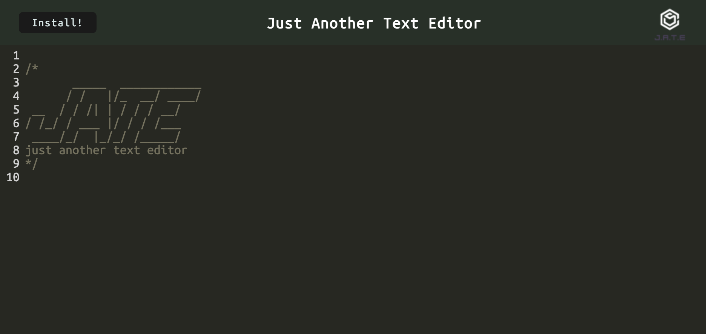
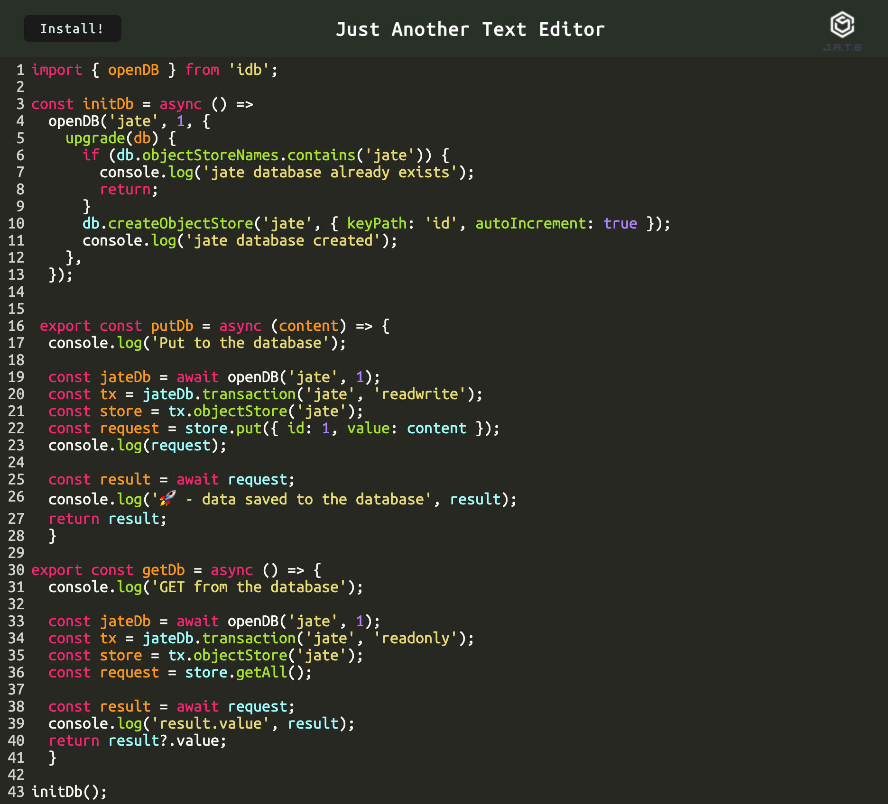

# PWA Text Editor: Just Another Text Editor

## About The Project

This is a complete application that works in your web browser. It includes different methods to store data so that if one method doesn't work, there are backup options available. The app also works even when you're offline, and you can easily download and install it by clicking on an "install" button.

[Click Here for the deployed app](https://jate-appz.herokuapp.com/)





<p align = "right">(<a href="#top">back to top</a>)</>

 ## Built With
* [Express.js](https://expressjs.com/) 
* [IndexedDB](https://developer.mozilla.org/en-US/docs/Web/API/IndexedDB_API)
* [if-env](https://www.npmjs.com/package/if-env)
* [babel-loader](https://www.npmjs.com/package/babel-loader)
* [css-loader](https://www.npmjs.com/package/css-loader)
* [style-loader](https://www.npmjs.com/package/style-loader)
* [Webpack](https://webpack.js.org/)
* [html-webpack-plugin](https://www.npmjs.com/package/html-webpack-plugin)
* [webpack-pwa-manifest](https://www.npmjs.com/package/webpack-pwa-manifest)
* [code-mirror-themes](https://www.npmjs.com/package/code-mirror-themes)

<p align = "right"> (<a href="#top">back to top</a>)</>

## Getting Started

To get a local copy up and running follow these simple example steps.

 ## Installation

The application will be invoked by using the following command:

```
git clone git@github.com/Mufasa91/Mod19Challenge_PWA-Text-Editor
```
Also, please make sure to install npm packages by using the following command:
```
npm i 
```
Then,
```
npm start
```

<p align="right">(<a href="#top">back to top</a>)</>

## License

[](https://opensource.org/licenses/MIT)

Distributed under MIT License.

See LICENSE.txt for more information.

<p align ="right">(<a href="#top">back to top</a>)</>

Project Link: [https://github.com/ayacomputer/19-PWA-Text-Editor](https://github.com/ayacomputer/19-PWA-Text-Editor)

<p align="right">(<a href="#top">back to top</a>)</>


